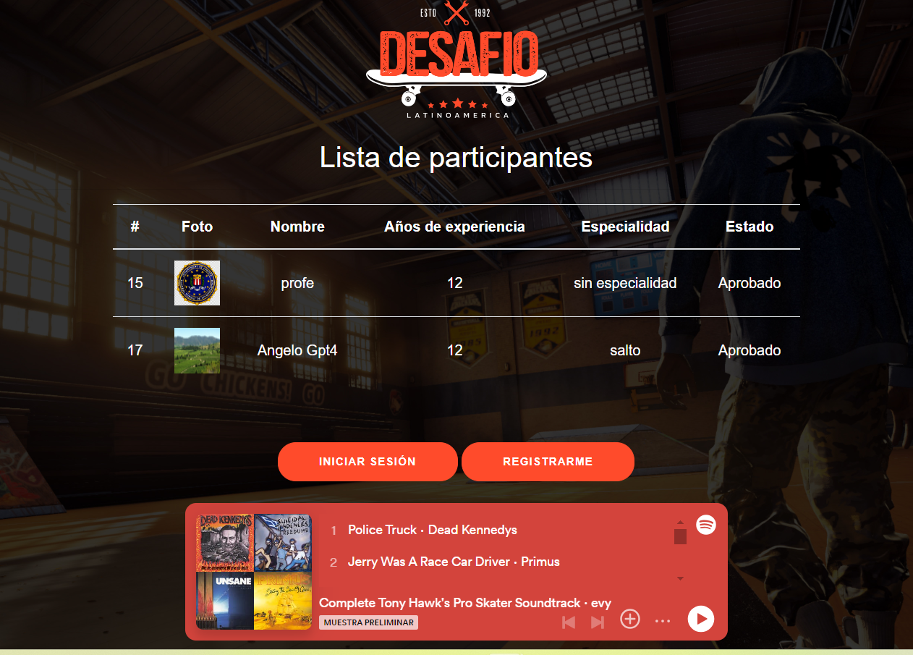

# Proyecto Skatepark
Este proyecto consiste en una plataforma web para la inscripción y gestión de skaters que desean participar en una competencia de Skate organizada por la Municipalidad de Santiago.
## Las tecnologías y herramientas utilizadas:
- Express
- Handlebars
- PostgreSQL
- JWT
- Express-fileupload
- nodemailer
## Estructura de carpetas
El proyecto tiene la siguiente estructura de carpetas:
```
- public/
  - img/
  - js/
  -style/
- views/
- views/componentes/
- server.js
- queries.js
- email.js
- package.json
```
- La carpeta `public/` contiene archivos estáticos como imágenes.
- La carpeta `views/` contiene las vistas de la aplicación.
- La carpeta `views/componentes/` contiene los componentes de las vistas.
- `server.js` es donde se encuentra la lógica principal del servidor.
- `queries.js` contiene las consultas SQL para interactuar con la base de datos.
- `email.js` se encarga del envío de correos electrónicos.
- `package.json` contiene la configuración del proyecto.
## Base de datos
Se ha utilizado PostgreSQL para la base de datos del proyecto. Se ha creado la siguiente estructura de tabla:
```sql
CREATE DATABASE skatepark;
CREATE TABLE skaters (
  id SERIAL,
  email VARCHAR(50) NOT NULL,
  nombre VARCHAR(25) NOT NULL,
  password VARCHAR(25) NOT NULL,
  anos_experiencia INT NOT NULL,
  especialidad VARCHAR(50) NOT NOT,
  foto VARCHAR(255) NOT NULL,
  estado BOOLEAN NOT NULL
);
```
La tabla `skaters` contiene la información de los skaters que se registran en la plataforma, incluyendo su email, nombre, contraseña, años de experiencia, especialidad, foto y estado de inscripción.
## Explicación del proyecto
La Municipalidad de Santiago ha organizado una competencia de Skate y ha desarrollado esta plataforma web para que los skaters puedan registrarse y ver el estado de su solicitud. El proyecto utiliza Express y Handlebars para el frontend, PostgreSQL para la base de datos, JWT para la autenticación y Express-fileupload para la carga de archivos.
El servidor está configurado para servir archivos estáticos, parsear cuerpos JSON y URL-encoded, y manejar la carga de archivos. Se han implementado rutas para el registro, inicio de sesión, recuperación de contraseña, actualización de usuario y eliminación de usuario. Además, se ha creado una ruta para que los administradores cambien el estado de inscripción de los skaters.
El proyecto busca mejorar el nivel deportivo de los jóvenes skaters y promover su participación en competencias internacionales como los X Games.
Para ejecutar el servidor, se debe ingresar el comando `node server.js` y acceder a `http://localhost:3000` en un navegador.
¡Únete a la competencia de Skate y demuestra tus habilidades en la tabla de clasificación! :monopatín::trofeo:
